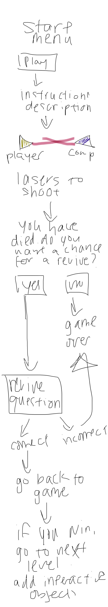

:warning: Everything between << >> needs to be replaced (remove << >> after replacing)

#  Binghamton Assassins 
## CS110 Final Project   Spring, 2024 

## Team Members

 n/a 
***

## Project Description

Will be like the popular high school game Assassins, except playing against the computer. You will get three tries to shoot the computer while also being shot at. If dead, there is a chance for a revive. Goal is to kill the computer in the number of bullets given and also to not get killed. 

***    

## GUI Design

### Initial Design

### Final Design

## Program Design

### Features

1. start menu
2. moveable character
3. level up after winning
4. interactive objects
5. revive feature

### Classes

class Player:
    
    def __init__(self, screen, x, y, img_file):
        self.screen = screen
        self.x = x
        self.y = y
        self.img_file = img_file
        self.img = pygame.image.load(img_file)
        self.bullets = 4
    def move_right(self):
        """
        moves position right by 1
        args: None
        return: None
        """
        self.x+=2
    def move_left(self):
        """
        moves position left by 1
        args: None
        return: None
        """
    def shoot(self, enemy):
        self.bullets -= 1
        if(self.bullets <= 0):
            exit()
        bullet = Bullet("./assets/bullet.png", self.screen, True, self.x + 124, self.y+50, enemy)
        bullet.move()
        """
        creates bullet object
        args: None
        return: Bullet
        """
    
    def draw(self):
        self.screen.blit(self.img, (self.x, self.y))
        
class Game:
    def __init__(self):
        """
        Initializes game object
        Args: None
        Returns: None
        """
    def start_menu(self):
        """
        The start menu shows up (shows a start button with instructions and explanation, possibly what level you are currently on)
        Args: None
        Returns: None
        """
    def level_up(self):
        """
        Game gets more difficult if you win
        Args: None
        Returns: None
        """

## ATP

| Step                 |Procedure             |Expected Results                   |
|----------------------|:--------------------:|----------------------------------:|
|  1                   | Run Counter Program  |GUI window appears with count = 0  |
|  2                   | click count button   | display changes to count = 1      |
etc...
